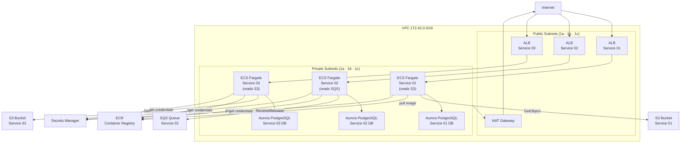

# ECS/RDS Environment Lab

A Terraform lab environment showing ECS Fargate with multiple services, Aurora PostgreSQL, ECR, S3, SQS, VPC routing, security groups, and Secrets Manager integration.

## Architecture



## Repository Structure

```
envs/dev/
├── vpc.tf               # VPC, subnets, IGW, NAT gateway, route tables, security groups
├── ecs.tf               # ECS cluster, task definitions, services, ALBs per service
├── rds.tf               # Aurora PostgreSQL clusters (one per service)
├── ecr.tf               # ECR repositories
├── s3.tf                # S3 buckets (per service)
├── sqs.tf               # SQS queue
├── ec2.tf               # Bastion/utility EC2 (optional)
├── vars.tf              # Input variables
├── container-defs/      # ECS container definition JSON files
└── policy-docs/         # IAM task policies per service
```

## Prerequisites

- [Terraform](https://learn.hashicorp.com/tutorials/terraform/install-cli) installed
- [AWS CLI](https://docs.aws.amazon.com/cli/latest/userguide/getting-started-install.html) configured
- S3 bucket for Terraform remote state
- Secrets Manager secret with database credentials

## Usage

```shell
terraform init
terraform plan
terraform apply
```

To tear down:
```shell
terraform destroy
```
